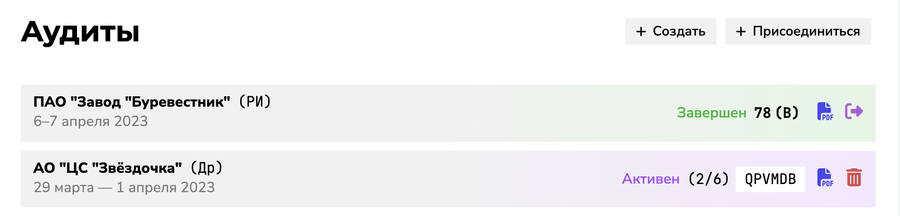

# Автоматизация процесса проведения аудитов поставщика

Приложение позволяет в электронном виде проводить аудиты поставщика согласно корпоративному стандарту АО «ОСК», а также формировать отчеты в формате PDF.

## Страница Аудитов

Тут отображаются все аудиты, которые вы создали или в которых принимали участие.

Слева — название и даты проведения аудита. Справа — статус аудита (`Активен`/`Заблокирован`/`Завершен`). Далее отображается количество заполненных аудитов (для `Активных`), либо итоговый результат и класс соответствия (для `Завершенных`). 

Кнопка с иконкой файла позволяет сформировать отчет по всем чек-листам в формате PDF. 
