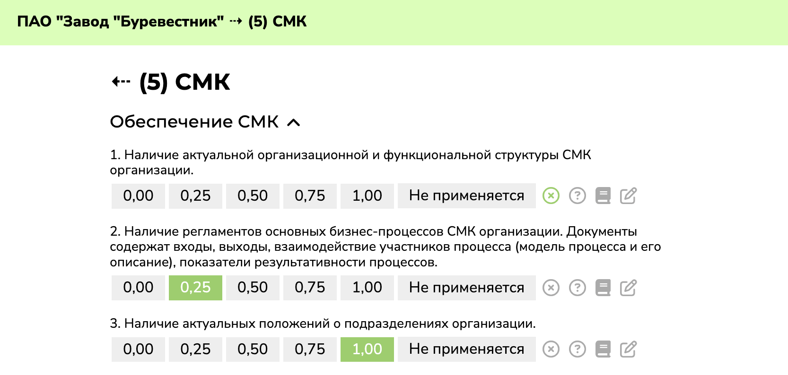
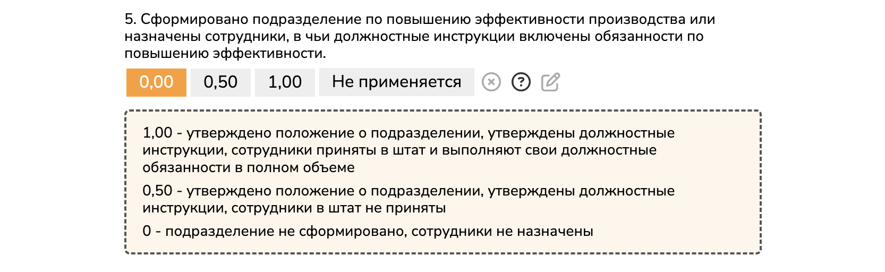
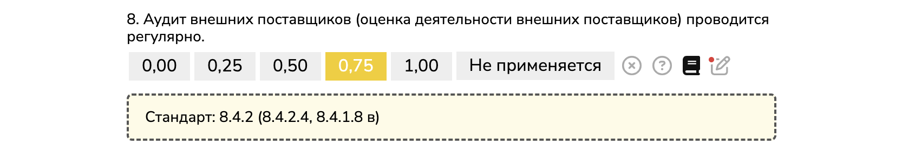

# Автоматизация процесса проведения аудитов поставщика

Приложение позволяет в электронном виде проводить аудиты поставщика согласно корпоративному стандарту АО «ОСК», а также формировать чек-листы в формате PDF.

## Схема проведения аудитов

Аудит состоит из чек-листов (всего составлено 10 чек-листов, их набор зависит от профиля предприятия). Каждый чек-лист состоит из 10–50 критериев, по которым аудитор выставляет оценки `0`, `0,25`, `0,5`, `0,75`, `1` (также критерий может `Не применяться`, тогда он исключается из расчета). Отношение оценок с учетом показателей значимости к максимально возможной оценке — `показатель соответствия`. Чтобы получить `итоговую оценку` по чек-листу, нужно `показатель соответствия` умножить на `весовой коэффициент` чек-листа (установленный стандартом) и `корректирующий коэффициент` (зависящий от наличия у организаций Группы ОСК претензий к качеству продукции или ведения договорной работы). `Результат аудита` — сумма `итоговых оценок` по чек-листам. 

Согласно результату аудита, предприятие получает класс соответствия, который помогает другим Обществам оценить надежность данного предприятия и сформировать АО «ОСК» мейкерс-лист поставщика. 

## Страница всех аудитов

Здесь отображаются все аудиты, которые вы создали или в которых принимали участие.

Каждый аудит отображается, как отдельная строчка с градиентом, соответствующем статусу аудита.

Слева отображается название и профиль предприятия, даты проведения аудита. 

Справа — статус аудита (`Активен`/`Заблокирован`/`Завершен`). Далее отображается количество заполненных аудитов (для `Активных`), либо итоговый результат и класс соответствия (для `Завершенных`). 

Кнопка  позволяет сформировать все чек-листы аудита в формате PDF. 

Кнопка  (отображается только у руководителя группы аудита) удаляет созданный аудит. 

Кнопка  (у остальных аудиторов) позволяет покинуть аудит.

Также у руководителя группы аудита отображается `ABCDEF` 6-буквенный код аудита, с помощью которого эксперты могут присоединяться к аудиту.

Вверху страницы находятся кнопки, которые позволяют `Создать` новый аудит или `Присоединиться` к существующему. Создавать аудит должен руководитель его группы.

 

## Страница аудита

Сверху отображается название предприятия и корректирующий коэффициент (`1.00`)

**Доступно всем аудиторам:**

&nbsp;`Сформировать PDF` — формирует все чек-листы в PDF. Это выглядит примерно так:

**Доступно только руководителю группы аудита:**

&nbsp;`Аудиторы` — открывает список всех, экспертов, участвующих в аудите. Здесь возможно распределить чек-листы между аудиторами или исключить эксперта из аудита. Также на этой странице можно <nobr>&nbsp;`Сменить код`</nobr> аудита из соображений безопасности (кроме того, он автоматически изменится при исключении кого-либо из аудита)

&nbsp;`Редактировать` — позволяет изменить параметры, указанные при создании аудита, кроме профиля предприятия

&nbsp;`Заблокировать` — позволяет запретить редактирование чек-листов всеми аудиторами (блокировку можно отменить)

&nbsp;`Завершить` — появляется вместо кнопки `Заблокировать`, когда заполнены все чек-листы. Блокирует редактирование всех чек-листов и выводит итоговый результат аудита (завершение можно отменить)

Каждый чек-лист имеет свой уникальный цвет. Градиент сильно упрощает ориентирование между чек-листами. Слева — цвет чек-листа, справа — цвет статуса чек-листа

Слева отображается номер и название чек-листа. Справа — статус чек-листа (`Создан`/`В работе`/`Заполнен`), количество заполненных критериев (для тех, которые `В работе`), итоговая оценка (для `Заполненных`). Далее — весовой коэффициент чек-листа (руководитель группы аудита может корректировать его только если профиль предприятия `Другое`, в остальных случаях значение установлено автоматически в соответствии со стандартом1). 

Кнопка  позволяет сформировать PDF-файл одного чек-листа. 

Кнопки  и  показывают, в каких чек-листах вы участвуете. Если вы присоединяетесь к чек-листу, ваша фамилия отобразится в PDF-файле чек-листа.

*1 Весовые коэффициенты чек-листов по профилям поставщика в соответствии со стандартом:*
<table>
    <tr>
        <td>№</td>
        <td><nobr>Чек-лист</nobr></td>
        <td>Разработчик-изготовитель&nbsp;(РИ)</td>
        <td>Разработчик (Р)</td>
        <td>Изготовитель (И)</td>
        <td>Оказание услуг&nbsp;(У)</td>
        <td>Дилер&nbsp;(Д)</td>
    </tr>
    <tr>
        <td>0</td>
        <td>Планирование</td>
        <td>0,05</td><td>0,05</td><td>0,05</td><td>0,05</td><td>0,1</td>
    </tr>
    <tr>
        <td>1</td>
        <td>Производство</td>
        <td>0,15</td><td>—</td><td>0,2</td><td>0,15</td><td>—</td>
    </tr>
    <tr>
        <td>2</td>
        <td>Бережливость</td>
        <td>0,1</td><td>0,1</td><td>0,1</td><td>0,1</td><td>0,1</td>
    </tr>
    <tr>
        <td>3</td>
        <td>Разработка</td>
        <td>0,15</td><td>0,55</td><td>—</td><td>—</td><td>—</td>
    </tr>
    <tr>
        <td>4</td>
        <td>Технология</td>
        <td>0,1</td><td>—</td><td>0,15</td><td>0,15</td><td>—</td>
    </tr>
    <tr>
        <td>5</td>
        <td>СМК</td>
        <td>0,1</td><td>0,2</td><td>0,15</td><td>0,15</td><td>0,2</td>
    </tr>
    <tr>
        <td>6</td>
        <td>Контроль&nbsp;качества</td>
        <td>0,15</td><td>—</td><td>0,15</td><td>0,15</td><td>0,15</td>
    </tr>
    <tr>
        <td>7</td>
        <td>Персонал</td>
        <td>0,05</td><td>0,1</td><td>0,05</td><td>0,1</td><td>0,05</td>
    </tr>
    <tr>
        <td>8</td>
        <td>Закупки</td>
        <td>0,1</td><td>—</td><td>0,1</td><td>0,1</td><td>0,3</td>
    </tr>
    <tr>
        <td>9</td>
        <td>Склад</td>
        <td>0,05</td><td>—</td><td>0,05</td><td>0,05</td><td>0,1</td>
    </tr>
</table>

## Страница чек-листа

На этой странице отображаются критерии и возможные оценки по ним. Также все элементы дизайна страницы имеют цвет уникальный для каждого чек-листа

**Справа отображаются функциональные кнопки:**

 — отменяет выставленную оценку
 
 — открывает справочную информацию об оценках

 — открывает справочную информацию о пунктах стандарта

&nbsp;— отображает поле для введения обоснования оценки или комментария (это поле обязательно для заполнения при выборе пункта `Не применяется`, поэтому открывается автоматически).
 
 — показывает, что к данному критерию написан комментарий

## Адаптивность

Приложение корректно отображается как на больших экранах, так и на телефонах и планшетах, что делает работу в полевых условиях значительно более удобной.

